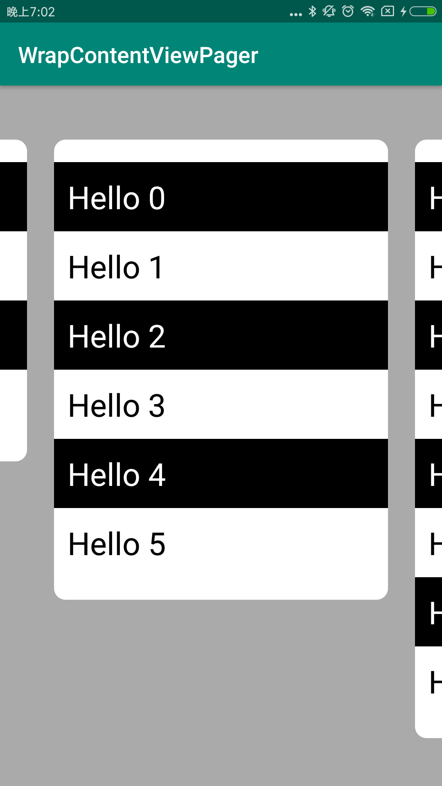

this is a drop in replacement of support library viewpager that supports wrap_content in the layout_height direction

some points:

1, in my test, it supports RecyclerView, FragmentPagerAdapter/FragmentStatePagerAdapter, and padding

2, performance should be mostly as good as the original viewpager, as this implementation modifies the default onMeasure() method rather than calling super.onMeasure() twice

3, ignores decor view, as I personally don't use it. but it should not be too hard to modify it to support that

this library is a by product of the [speaka](http://www.speaka.live) app

speaka is an english(second language) learning app for children

you can download it from here:
[download speaka app](http://app.mi.com/details?id=com.joyworld.joyworld)